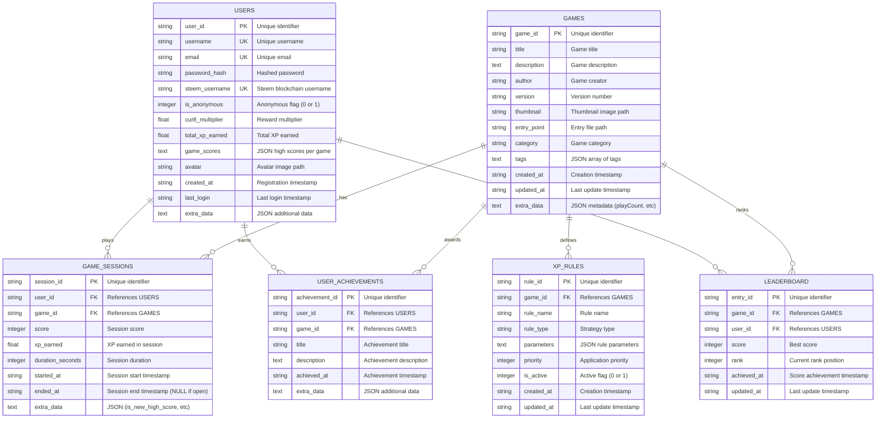

# Schema ER del Database - Game Platform

## Diagramma ER Completo



## Indici e Constraints

```mermaid
graph TD
    A[GAMES] --> A1["PK: game_id"]
    
    B[USERS] --> B1["PK: user_id"]
    B --> B2["UK: username"]
    B --> B3["UK: email"]
    B --> B4["UK: steem_username"]
    
    C[GAME_SESSIONS] --> C1["PK: session_id"]
    C --> C2["FK: user_id → USERS"]
    C --> C3["FK: game_id → GAMES"]
    C --> C4["INDEX: user_id"]
    C --> C5["INDEX: game_id"]
    
    D[USER_ACHIEVEMENTS] --> D1["PK: achievement_id"]
    D --> D2["FK: user_id → USERS CASCADE DELETE"]
    D --> D3["FK: game_id → GAMES CASCADE DELETE"]
    
    E[LEADERBOARD] --> E1["PK: entry_id"]
    E --> E2["FK: game_id → GAMES CASCADE DELETE"]
    E --> E3["FK: user_id → USERS CASCADE DELETE"]
    E --> E4["UNIQUE: (game_id, user_id)"]
    E --> E5["INDEX: (game_id, score DESC)"]
```



---

## Descrizione delle Entità

### 🎮 **GAMES** - Catalogo Giochi

Memorizza tutti i giochi registrati sulla piattaforma.

| Campo | Tipo | Descrizione |
|-------|------|-------------|
| `game_id` | STRING (PK) | Identificatore univoco del gioco |
| `title` | STRING | Titolo del gioco |
| `description` | TEXT | Descrizione dettagliata |
| `author` | STRING | Creatore del gioco |
| `version` | STRING | Versione (default: "1.0.0") |
| `thumbnail` | STRING | Path immagine di anteprima |
| `entry_point` | STRING | Path file HTML principale |
| `category` | STRING | Categoria (default: "uncategorized") |
| `tags` | TEXT (JSON) | Array di tag `["action", "multiplayer"]` |
| `created_at` | STRING | Timestamp creazione (ISO 8601) |
| `updated_at` | STRING | Timestamp ultimo aggiornamento |
| `extra_data` | TEXT (JSON) | Metadati aggiuntivi (playCount, difficulty, rating) |

**Note:**
- `extra_data` contiene: `playCount` (incrementato ad ogni avvio gioco)
- `tags` e `extra_data` sono JSON serializzati come TEXT

---

### 👤 **USERS** - Utenti Piattaforma

Gestisce utenti registrati, anonimi e integrati con Steem blockchain.

| Campo | Tipo | Descrizione |
|-------|------|-------------|
| `user_id` | STRING (PK) | ID univoco (`user_*` o `anon_*`) |
| `username` | STRING (UK) | Username (NULL per anonimi) |
| `email` | STRING (UK) | Email (NULL per anonimi) |
| `password_hash` | STRING | Password SHA-256 (NULL per anonimi) |
| `steem_username` | STRING (UK) | Username Steem blockchain |
| `is_anonymous` | INTEGER | Flag anonimo (0=registrato, 1=anonimo) |
| `cur8_multiplier` | FLOAT | Moltiplicatore ricompense (default: 1.0) |
| `total_xp_earned` | FLOAT | Totale XP guadagnato |
| `game_scores` | TEXT (JSON) | High scores per gioco `{"snake": 1500}` |
| `avatar` | STRING | Path avatar utente |
| `created_at` | STRING | Timestamp registrazione |
| `last_login` | STRING | Timestamp ultimo accesso |
| `extra_data` | TEXT (JSON) | Dati aggiuntivi |

**Tipi di Utente:**
1. **Registrato**: username/email/password
2. **Anonimo**: solo `user_id` (formato: `anon_xxxxxxxxxx`)
3. **Steem**: integrazione blockchain

**Note:**
- `game_scores` memorizza il punteggio più alto per ogni gioco
- `cur8_multiplier` può essere maggiorato per utenti premium

---

### 🎯 **GAME_SESSIONS** - Sessioni di Gioco

Traccia ogni partita giocata dagli utenti.

| Campo | Tipo | Descrizione |
|-------|------|-------------|
| `session_id` | STRING (PK) | ID univoco (`session_*`) |
| `user_id` | STRING (FK) | Riferimento a USERS |
| `game_id` | STRING (FK) | Riferimento a GAMES |
| `score` | INTEGER | Punteggio finale |
| `xp_earned` | FLOAT | XP guadagnato nella sessione |
| `duration_seconds` | INTEGER | Durata in secondi |
| `started_at` | STRING | Timestamp inizio |
| `ended_at` | STRING | Timestamp fine (NULL se aperta) |
| `extra_data` | TEXT (JSON) | Dati aggiuntivi (`is_new_high_score`, `xp_breakdown`, `base_xp`) |

**Calcolo XP:**
Gli XP vengono ora calcolati usando il sistema di regole configurabile (vedi XP_RULES).
Il calcolo legacy di fallback è:
```python
base_xp = (score × 0.01) + (min(minutes, 10) × 0.1)
if is_new_high_score:
    base_xp += 10.0
xp_earned = base_xp × user.cur8_multiplier
```

**Stati Sessione:**
- **Aperta**: `ended_at = NULL`
- **Chiusa**: `ended_at` contiene timestamp

**Note:**
- Sessioni aperte possono essere forzate alla chiusura
- Trigger automatici aggiornano LEADERBOARD al termine
- `extra_data` contiene `xp_breakdown` con dettagli del calcolo XP

---

### 🎯 **XP_RULES** - Regole di Calcolo XP

Definisce come vengono calcolati gli XP per ogni gioco usando il pattern Strategy.

| Campo | Tipo | Descrizione |
|-------|------|-------------|
| `rule_id` | STRING (PK) | ID univoco (`xpr_*`) |
| `game_id` | STRING (FK) | Riferimento a GAMES |
| `rule_name` | STRING | Nome descrittivo della regola |
| `rule_type` | STRING | Tipo di strategia di calcolo |
| `parameters` | TEXT (JSON) | Parametri specifici della regola |
| `priority` | INTEGER | Priorità applicazione (più alto = prima) |
| `is_active` | INTEGER | Regola attiva (0=no, 1=sì) |
| `created_at` | STRING | Timestamp creazione |
| `updated_at` | STRING | Timestamp aggiornamento |

**Tipi di Regole (`rule_type`):**

1. **`score_multiplier`** - XP basato sul punteggio
   ```json
   {
     "multiplier": 0.01,
     "max_xp": 100.0
   }
   ```
   Formula: `xp = min(score × multiplier, max_xp)`

2. **`time_bonus`** - Bonus basato sul tempo giocato
   ```json
   {
     "xp_per_minute": 0.1,
     "max_minutes": 10
   }
   ```
   Formula: `xp = min(duration_minutes, max_minutes) × xp_per_minute`

3. **`threshold`** - Bonus per soglie raggiunte
   ```json
   {
     "thresholds": [
       {"score": 5000, "xp": 100},
       {"score": 2500, "xp": 50},
       {"score": 1000, "xp": 25}
     ]
   }
   ```
   Assegna XP della soglia più alta raggiunta

4. **`high_score_bonus`** - Bonus per nuovo record
   ```json
   {
     "bonus_xp": 10.0
   }
   ```
   Assegnato solo se `is_new_high_score = true`

5. **`combo`** - Bonus per condizioni multiple
   ```json
   {
     "min_score": 1000,
     "min_duration": 60,
     "bonus_xp": 20.0
   }
   ```
   Bonus se ENTRAMBE le condizioni sono soddisfatte

6. **`percentile_improvement`** - XP per miglioramento %
   ```json
   {
     "xp_per_percent": 0.5,
     "max_xp": 50.0
   }
   ```
   Formula: `xp = min(improvement_percent × xp_per_percent, max_xp)`

**Esempio di Configurazione per Snake:**
```python
# Regola 1: Base score
{
  "rule_name": "Base Score Multiplier",
  "rule_type": "score_multiplier",
  "parameters": {"multiplier": 0.01, "max_xp": 100},
  "priority": 10
}

# Regola 2: Milestones
{
  "rule_name": "Snake Milestones",
  "rule_type": "threshold",
  "parameters": {
    "thresholds": [
      {"score": 5000, "xp": 100},
      {"score": 1000, "xp": 25}
    ]
  },
  "priority": 20
}

# Regola 3: High score bonus
{
  "rule_name": "High Score Bonus",
  "rule_type": "high_score_bonus",
  "parameters": {"bonus_xp": 10.0},
  "priority": 15
}
```

**Note:**
- Le regole vengono applicate in ordine di `priority` (decrescente)
- Gli XP di tutte le regole attive vengono sommati
- Il totale viene moltiplicato per `user.cur8_multiplier`
- Sistema estendibile: nuove strategy possono essere aggiunte facilmente

---

### 🏆 **LEADERBOARD** - Classifiche Globali

Classifica dei migliori punteggi per ogni gioco.

| Campo | Tipo | Descrizione |
|-------|------|-------------|
| `entry_id` | STRING (PK) | ID univoco entry |
| `game_id` | STRING (FK) | Riferimento a GAMES |
| `user_id` | STRING (FK) | Riferimento a USERS |
| `score` | INTEGER | Punteggio migliore |
| `rank` | INTEGER | Posizione in classifica |
| `achieved_at` | STRING | Timestamp raggiungimento score |
| `updated_at` | STRING | Timestamp ultimo aggiornamento |

**Constraint:**
- `UNIQUE(game_id, user_id)`: un utente appare una sola volta per gioco

**Gestione Automatica:**
- Trigger SQL aggiornano automaticamente `rank` quando cambia `score`
- Sistema di ranking automatico basato su `ORDER BY score DESC`

**Note:**
- Ogni gioco ha una classifica separata
- Rank calcolato dinamicamente dai trigger

---

### 🎖️ **USER_ACHIEVEMENTS** - Achievement Utenti

Achievement sbloccati dagli utenti.

| Campo | Tipo | Descrizione |
|-------|------|-------------|
| `achievement_id` | STRING (PK) | ID univoco achievement |
| `user_id` | STRING (FK) | Riferimento a USERS |
| `game_id` | STRING (FK) | Riferimento a GAMES |
| `title` | STRING | Titolo achievement |
| `description` | TEXT | Descrizione dettagliata |
| `achieved_at` | STRING | Timestamp sblocco |
| `extra_data` | TEXT (JSON) | Dati aggiuntivi |

**Note:**
- Achievement possono essere specifici per gioco o globali
- `extra_data` può contenere metadati (rarità, punti, icona)

---

## Relazioni tra Entità

### 1. **GAMES ↔ GAME_SESSIONS** (1:N)
```
Un gioco può avere molte sessioni
Una sessione appartiene a un solo gioco
ON DELETE CASCADE
```

### 2. **USERS ↔ GAME_SESSIONS** (1:N)
```
Un utente può giocare molte sessioni
Una sessione appartiene a un solo utente
ON DELETE CASCADE
```

### 3. **GAMES ↔ LEADERBOARD** (1:N)
```
Ogni gioco ha una sua classifica
Una entry appartiene a un solo gioco
ON DELETE CASCADE
UNIQUE(game_id, user_id)
```

### 4. **USERS ↔ LEADERBOARD** (1:N)
```
Un utente può comparire in più classifiche
Una entry appartiene a un solo utente
ON DELETE CASCADE
```

### 5. **GAMES ↔ USER_ACHIEVEMENTS** (1:N)
```
Un gioco può assegnare molti achievement
Un achievement appartiene a un solo gioco
ON DELETE CASCADE
```

### 6. **USERS ↔ USER_ACHIEVEMENTS** (1:N)
```
Un utente può sbloccare molti achievement
Un achievement appartiene a un solo utente
ON DELETE CASCADE
```

### 7. **GAMES ↔ XP_RULES** (1:N)
```
Un gioco può avere molte regole XP
Una regola appartiene a un solo gioco
ON DELETE CASCADE
```

---

## Sistema di Trigger

### **Leaderboard Auto-Update Triggers**

Il sistema include trigger SQL automatici che mantengono la classifica aggiornata:

```sql
-- Trigger 1: Insert/Update su GAME_SESSIONS
-- Quando una sessione termina con un nuovo high score:
--   1. Aggiorna LEADERBOARD se score > current_best
--   2. Ricalcola rank di tutte le entry per quel gioco

-- Trigger 2: Update su LEADERBOARD
-- Quando un punteggio cambia:
--   1. Ricalcola rank basato su ORDER BY score DESC
--   2. Aggiorna updated_at
```

**Vantaggi:**
- ✅ Classifica sempre consistente
- ✅ Nessun calcolo manuale richiesto
- ✅ Performance ottimizzate

---

## Informazioni Tecniche

### **Database**
- **Tipo**: SQLite
- **Path**: `backend/app/game_platform.db`
- **ORM**: SQLAlchemy

### **Encoding**
- Timestamp: ISO 8601 (UTC)
- JSON: UTF-8
- Password: SHA-256 hash

### **Indici Creati**
```sql
-- USERS
CREATE UNIQUE INDEX idx_users_username ON users(username);
CREATE UNIQUE INDEX idx_users_email ON users(email);
CREATE UNIQUE INDEX idx_users_steem ON users(steem_username);

-- GAME_SESSIONS
CREATE INDEX idx_sessions_user ON game_sessions(user_id);
CREATE INDEX idx_sessions_game ON game_sessions(game_id);

-- LEADERBOARD
CREATE UNIQUE INDEX idx_leaderboard_game_user ON leaderboard(game_id, user_id);
CREATE INDEX idx_leaderboard_ranking ON leaderboard(game_id, score DESC);
```

### **File Principali**
- `backend/app/models.py` - Definizioni SQLAlchemy (incluso XPRule)
- `backend/app/database.py` - Funzioni CRUD e calcolo XP
- `backend/app/xp_calculator.py` - Sistema Strategy Pattern per calcolo XP
- `backend/app/leaderboard_triggers.py` - Setup trigger automatici
- `backend/migrate_xp_rules.py` - Script migrazione regole XP

---

## Esempi di Query Comuni

### Top 10 Leaderboard per un gioco
```python
from app.database import get_db_session
from app.models import Leaderboard, User

with get_db_session() as session:
    top_10 = session.query(Leaderboard, User).join(User).filter(
        Leaderboard.game_id == 'snake'
    ).order_by(Leaderboard.rank).limit(10).all()
```

### High Scores di un utente
```python
user = get_user_by_id('user_abc123')
game_scores = json.loads(user['game_scores'])
# {'snake': 1500, 'pong': 800}
```

### Sessioni recenti
```python
from app.database import get_user_sessions
sessions = get_user_sessions('user_abc123', limit=5)
```

### Totale XP guadagnato
```python
user = get_user_by_id('user_abc123')
total_xp = user['total_xp_earned']
```

---

## Note di Migrazione

Il database è stato migrato da schema SQL raw a SQLAlchemy ORM:
- ✅ Maggiore type safety
- ✅ Relazioni esplicite
- ✅ Session management automatico
- ✅ Trigger preservati

**Compatibilità:** tutte le funzioni legacy sono mantenute per retrocompatibilità.
